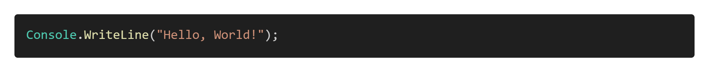

# Activity: Hello, World!

## Introduction

In this activity, we embark on a fundamental journey into programming with C# using Visual Studio Code (VS Code) and the C# Dev Kit. The iconic "Hello, World!" program is our gateway into understanding the basics of C# development and familiarizing ourselves with essential tools.

But why "Hello, World!"? This seemingly simple program holds significant importance in the world of programming. It serves as the starting point for beginners, introducing them to the syntax, structure, and execution of a program in a new language and ensuring their development tools are installed correctly.

## Learning Outcomes

By the end of this lesson, you should be able to:

1. Create new console application projects using the terminal and command palette.
2. Identify the file and folder components of a console application.
3. Describe the components of the hello world statement.

## Walkthrough

We will cover two ways to create projects using VS Code and the C# Dev Kit. In either case, you should first create a folder for your project. On your computer, create a directory to hold all of your projects, such as "code" or "cs1200" then create a subfolder named `HelloWorld`.

Next, open the folder in VS Code. There are three ways to do this:

1. In the **Explorer**, click the open folder button, navigate to and choose the HelloWorld folder.
2. In the **File Menu**, choose the open folder button, navigate to and choose the HelloWorld folder.
3. In your **Terminal**, navigate to the HelloWorld folder and type `code .` to launch VS Code with that folder open.

Then, we need to create our project. There are two ways to do this.

### Using the Command Palette

Some extensions add commands to the command palette. You can access this by pressing **Ctrl + Shift + P** on Windows/Linux or **⌘ + shift + P** on macOS. Then perform the following steps:

1. Find and select the **.NET: New Project** command.
2. A list of templates will appear. These templates provide starter code for various project types, including web, desktop, and mobile development. Choose the **Console app** template.
3. It will prompt you for a project name. Type **HelloWorld**.
4. It will ask if you want to create the project in the default directory, the currently opened folder. Choose this option.

You should see the Explorer update and add a subfolder and code files:

Let's cover each of these files and folders:

* `HelloWorld.sln` is a .NET **solution file**. Later, you may have multiple projects when we create more complicated solutions. A solution file organizes multiple projects into a single solution to make managing this process easier.
* `HelloWorld.csproj` is the **project file** for our console application. It contains settings such as the target framework version (8.0), the output type, and references to packages and other projects that should be imported and used.
* `Program.cs` is the entry point into a console application. This is where we put the main code. Later on, we will see that we can create other files and classes, but Program.cs is where the application starts.
* The `bin` folder stands for "binary" and contains the binary files your application needs to run. When you compile your application, the output files, such as your **.exe** are placed in this directory.
* The `obj` folder stands for "object" and is used by the compiler during the build process. You will rarely need to view or modify its contents.

### Using the Terminal

You may also use the terminal to create a new project. In VS Code, click the "Terminal" menu option and choose "New Terminal". The terminal prompt should display the opened folder's directory:

Now type the command `dotnet new console`. This will create a slightly different directory structure. By default, it will name the project the same name as the folder you have opened, but it will not create the project in a subfolder with a solution file. For simple applications, this is fine, but when creating applications with multiple project files, you will want to create a solution file and subfolders the way the command palette did.

> You can get a list of all of the templates with the command `dotnet new list`

If you want to specify your project name and other options, type `dotnet new console -h` to see a list of all the arguments. The `-n` option allows you to specify a name.

### The Program.cs File

What we see here is a single line of code:

We will go into more detail on this code later, but there are a few components to this line of code:

* `Console` is a **type**. Type definitions store data and have behaviors in C#.
* `WriteLine` is a **method**. Methods and functions are effectively synonyms depending on the language you are working with. In C#, methods always have parenthesis containing any parameters, which are data for the method. WriteLine() writes a line of text to the console/terminal window.
* `"Hello, World!"` is a string, as the double quotes signify.
* A semi-colon character terminates (signals the end of) a code **statement**.

So, in English, this line of code reads: "Invoke the `Console` type's `WriteLine()` method with a string parameter of `Hello, World!`".

### Running the Application

To run the application, type ``dotnet run` in the terminal. You should see the following output:

## Other Useful Terminal Commands

Here are some other useful dotnet console arguments:

| Command                                | Description                                                  |
| -------------------------------------- | ------------------------------------------------------------ |
| `-h`                                   | Shows the help file, which lists all possible commands and other information. |
| `--info`                               | Shows information about the version of .NET and other libraries you have installed. |
| `dotnet new -h`                        | Displays help for the dotnet new command.                    |
| `dotnet new list`                      | Lists all project and solution templates available. (Look at all the cool things you can build with .NET!) |
| `dotnet run`                           | Runs a project or solution (you can also use the F5 key)     |
| `dotnet add reference` \| `package`    | Adds a package or a reference to a .NET project.  *You will not need this until you have multiple projects.* |
| `dotnet remove reference` \| `package` | Removes a package or reference to a .NET project  *You will not need this until you have multiple projects.* |
| `dotnet restore`                       | Restores the dependencies (nuget packages, etc.) for a project. Oftentimes GitHub repositories will only contain links to packages, not the actual files, so this will download them into your project. |
| `dotnet test`                          | Runs tests using a test runner.                              |

## Conclusion

Visual Studio Code can have a high learning curve, but because of its strong community support, there are many resources available to help you become an effective user of this tool.

As with any tool, getting comfortable takes some time and practice!
